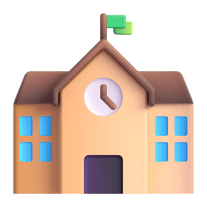
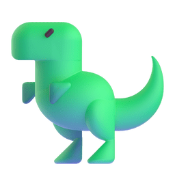
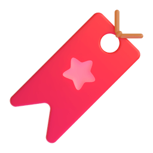

# Hi There, I'm Sanskruti! 

**Software Engineer @ Deloitte India**  
Backend Systems | Distributed Architecture | Java Fullstack Development 

I design and build scalable backend systems with a strong foundation in computer science fundamentals. Deeply interested in ML, GenAI, Deep Learning and Neural Networks. 
Currently working at Deloitte, where I contribute to production-grade applications and continuously refine my expertise in system design, performance optimization, and clean architecture.

I am dedicated to constantly learning, always striving to stay at the forefront of new technologies. 

My IKIGAI?
> Code. Books. Cats. Coffee. Philosophy. 

**Let's hack together!**  

## What I Do 🚀 

- Build production-ready backend systems & RESTful APIs  
- Design modular, scalable architectures  
- Apply data structures & algorithms in real-world systems  
- Experiment with applied machine learning models  
- Optimize performance and improve system reliability  

## Core Strengths 🧠 

- Data Structures & Algorithms  
- Object-Oriented Design  
- Database Design & Query Optimization  
- REST API Design  
- Concurrency & Multithreading Basics  
- Clean Code & SOLID Principles  

## Tech Stack 🛠 

### Languages
`Python` | `Java` | `C++` | `JavaScript` | `C`

### Backend
`Spring Boot` | `Node.js` | `Express` | `Django`

### Frontend
`React` | `Next.js` | `TailwindCSS`

### Databases
`MySQL` | `PostgreSQL`| `MongoDB`

### Dev & Infrastructure
`Git` | `Docker` | `Linux` | `Postman` | `VS Code` | `Jupyter Notebook` | `Google Colab` | `Figma` | `Draw.io` | `AWS`| `Swift`

## Current Focus 📌 

- Distributed Systems & Microservices  
- System Design (HLD & LLD)  
- Backend performance optimization  
- Containerization & deployment strategies 

## Education 

-  **Usha Mittal Institute of Technology, SNDT University**:
  - **Bachelor of Technology Degree in Computer Science and Technology**
    - December, 2021 - 2025 | CGPA: 9.0/10.0

## Things I like to do in my free time 

-  **Coding** 
-  Listening Music  `rumour has it, sansu can make 7 playlists a month`
-  Petting a Cat `/ᐠ. .ᐟ\ฅ nya~ `
-  Watching True Crime Documentaries 
-  **Sleeping** `/ᐠ_ ꞈ _ᐟ\ᶻ 𝗓 𐰁` i'm insomniac `(you might find me reading instead)`
-  Currently Reading: **As Good as Dead** by Holly Jackson, **Uzumaki (Manga)** by Junji Ito 

## Want to Connect w me? 

&nbsp;[LinkedIn ](https://www.linkedin.com/in/sanskrutib/)(Let's Connect!)  
&nbsp;[Follow me on GitHub](https://github.com/sanskrutihere) 
 Email me: sanskrutib.dev@gmail.com 
&nbsp;[Follow me on Spotify](https://open.spotify.com/user/0miq78no324b1m38h1lkytpm3?si=a01d3a58b00a4c68) 

### Thanks for visiting!&nbsp;

##### Check out my repos 

> Still learning. Still building. Still evolving.

